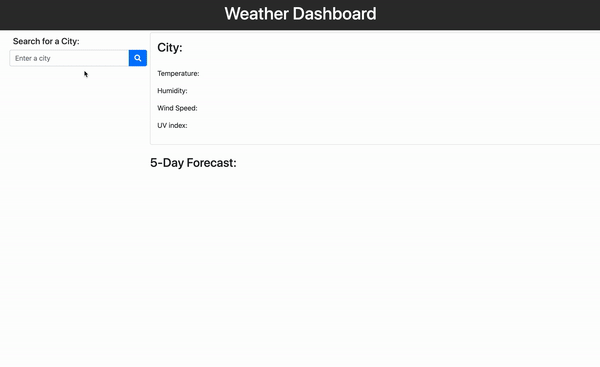

# Weather_Dashboard

Explore the [Project Page](https://github.com/jesshuang7/WeatherDashboardAPI)

View the [Github-pages](https://jesshuang7.github.io/WeatherDashboardAPI/)

## Table of Contents

* [About the Project](#about-the-project)
  * [User Story](#user-story)
  * [HTML](#html)
  * [Assets](#Assets)
  * [Built With](#built-with)
* [Getting Started](#getting-started)
  * [Prerequisites](#prerequisites)
  * [Installation](#installation)
* [Roadmap](#roadmap)
* [Contributing](#contributing)
* [License](#License)
* [Contact](#contact)
* [Acknowledgements](#acknowledgements)

## About the Project:
The focus of this project was to use the [OpenWeather API](https://openweathermap.org/api) to retrieve weather data for cities and use `localStorage` to store any persistent data. The dashboard will display the current weather of temperature, humidity, wind speed, and UV index, which will be color coded upon dangerness. It will also display the five-day forecast with its date, temperature, weather icon, humidity. The search history will be added as buttons to retreive history.




### User Story

```
AS A traveler
I WANT to see the weather outlook for multiple cities
SO THAT I can plan a trip accordingly
```

### HTML:
* [index.html](https://github.com/jesshuang7/WeatherDashboardAPI/blob/master/index.html)

### Assets:
* [style.css](https://github.com/jesshuang7/WeatherDashboardAPI/blob/master/Assets/style.css)

### Built With:
* This app is build upon [OpenWeather API](https://openweathermap.org/api)

## Getting Started:
To get a local copy up and running follow the steps below.

### Prerequisites:
None.

### Installation:
1. Clone the Repository:
```sh
git clone git@github.com:jesshuang7/WeatherDashboardAPI.git
```

## Roadmap:
Currently no known issues, but track track [open issues](https://github.com/jesshuang7/WeatherDashboardAPI/issues ) for proposed features (and known issues) in the future.


## Contributing:
Any contributions you make are **greatly appreciated**.

1. Fork the Project
2. Create your Feature Branch (`git checkout -b feature/AmazingFeature`)
3. Commit your Changes (`git commit -m 'Add some AmazingFeature'`)
4. Push to the Branch (`git push origin feature/AmazingFeature`)
5. Open a Pull Request

## License:

MIT License

Copyright (c) [2020] [Jessica Huang]

Permission is hereby granted, free of charge, to any person obtaining a copy
of this software and associated documentation files (the "Software"), to deal
in the Software without restriction, including without limitation the rights
to use, copy, modify, merge, publish, distribute, sublicense, and/or sell
copies of the Software, and to permit persons to whom the Software is
furnished to do so, subject to the following conditions:

The above copyright notice and this permission notice shall be included in all
copies or substantial portions of the Software.

THE SOFTWARE IS PROVIDED "AS IS", WITHOUT WARRANTY OF ANY KIND, EXPRESS OR
IMPLIED, INCLUDING BUT NOT LIMITED TO THE WARRANTIES OF MERCHANTABILITY,
FITNESS FOR A PARTICULAR PURPOSE AND NONINFRINGEMENT. IN NO EVENT SHALL THE
AUTHORS OR COPYRIGHT HOLDERS BE LIABLE FOR ANY CLAIM, DAMAGES OR OTHER
LIABILITY, WHETHER IN AN ACTION OF CONTRACT, TORT OR OTHERWISE, ARISING FROM,
OUT OF OR IN CONNECTION WITH THE SOFTWARE OR THE USE OR OTHER DEALINGS IN THE
SOFTWARE.

## Contact:
Jessica Huang - tzunuhuang@gmail.com

Project Link: [https://github.com/jesshuang7/WeatherDashboardAPI](https://github.com/jesshuang7/WeatherDashboardAPI)

## Acknowledgements: 
* University of Washington Coding Bootcamp for providing me with the skills and knowledge to create this project. 
